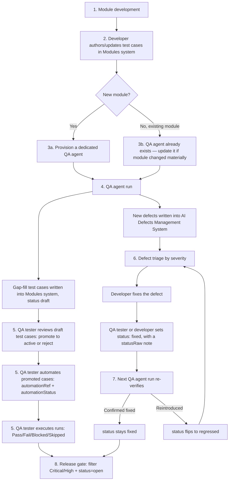

# QA Process: Module Development → Tests → QA Agents → Defect Lifecycle

This is the baseline standard process for how a Vibrantix module moves from development
through test authoring, QA agent validation, defect logging, and defect resolution — and
exactly where each step lands in `test-management-system/`. It's the process document to hand
a new developer, SDET, or QA agent operator so everyone follows the same loop.

**Scope:** this governs the **Modules** system (`data/modules/`) and the **AI Defects
Management System** (`data/defects/`) — the two systems in this repo with real, living content.
Frameworks/Logs/Audit Reports/Integrations follow the same authoring conventions once their
content phase begins (see README.md), but aren't part of this loop yet.

**Source of truth going forward:** new defects are written directly into `data/defects/` via
the schema and viewer already built here — not into `QA_Tracker/*.md`. `QA_Tracker/` stays
frozen as the historical record it was converted from (see README.md's "Defects conversion
scope"); it is not updated further. Practically, this means each QA agent's own definition
(outside this repo, in the agent registry) needs to be updated to write to `data/defects/`
instead of maintaining a `QA_Tracker/*_QA_LIVE_TRACKER.md` file — that update is a follow-up
task, not covered by this document.

## Roles

| Role | Responsible for |
|---|---|
| **Developer** | Building/changing the module; authoring the test cases that cover what they built, in the same PR |
| **QA Agent** | The module's specialized subagent (e.g. `Evidence_Management_QA_Agent`) — runs deeper validation than a developer's own tests, fills test-coverage gaps, and logs real defects it finds |
| **QA Tester / SDET** | Reviewing and promoting agent-authored test cases, writing the actual automated specs, executing manual runs, triaging and re-verifying defects |
| **Release Manager** | Reading the release gate report before sign-off (see Stage 8) |

## Process overview

## Stage 1 — Module development

Business as usual: a developer implements or changes a feature in the module's actual code
(`vibrantix-backend`, `vibrantix-client-panel`, or the relevant microservice). No
test-management-system involvement yet, beyond knowing which module slug this maps to in
`data/modules/manifest.json` (or that a new slug needs registering — see "New module
onboarding" below).

## Stage 2 — Developer authors test cases (→ Modules system)

**In the same PR as the code change**, the developer adds or updates test cases in
`data/modules/<slug>/<category>.json` covering what they built or fixed. This is not optional
QA follow-up — it's part of the change, reviewed alongside the code diff.

- Follow `schema/test-case.schema.json` / `SCHEMA.md` exactly: ID convention
  `<MODULE-PREFIX>-<CATEGORY-CODE>-<seq>`, correct `category` (matches the filename), `priority`,
  `type`, `steps`, `expectedResult` all required.
- New cases start `status: "draft"` — a developer's own test case isn't reviewed QA content yet
  (see Stage 5 for promotion to `active`).
- Minimum bar: at least one test case per new user-facing behavior and per bug fixed. Pure
  refactors with no behavior change may skip this, but say so explicitly in the PR description.
- PR review checklist item: "test cases added/updated for this change, or explicitly waived."

## Stage 3 — QA agent provisioning / maintenance

- **New module:** before its first QA agent run, a dedicated QA agent is created following the
  existing roster's pattern (see the agent list — one per module, named `<Module>_QA_Agent`).
  This is a one-time setup step, done once the module has real code and at least a baseline set
  of developer-authored test cases to build on.
- **Existing module:** its QA agent already exists. Update the agent's own definition when the
  module's real code paths change materially (new endpoints, new UI flows, a rewritten
  subsystem) or when a class of defect keeps recurring that the agent isn't yet checking for.
  This is a lower-frequency maintenance step, not part of every PR.

## Stage 4 — QA agent run (→ both systems)

A QA tester (or a scheduled/CI trigger — see "Cadence" below) invokes the module's QA agent.
The agent:

1. Reads the actual source code for the module.
2. Reads the module's existing test cases (`data/modules/<slug>/*.json`) to see what's already
   covered vs. what's missing.
3. Reads the module's existing open defects (`data/defects/<slug>/*.json`) so it doesn't
   re-report duplicates, and so it can re-verify previously logged defects against the current
   code (see Stage 7).
4. Produces two kinds of output:
   - **Test-coverage gap-fill** — new test cases written into
     `data/modules/<slug>/<category>.json`, `status: "draft"`, `owner: "QA"`. These go through
     the same review/promotion step as developer-authored ones (Stage 5).
   - **Defects** — real findings written into `data/defects/<slug>/<severity>.json`, following
     `schema/defect.schema.json`: a fresh `id` (continuing that module's existing prefix
     sequence), `severity`, `status: "open"` (or `"new"` if there's a case for distinguishing
     "just found" from "confirmed still open"), `sourceFile` set to something identifying this
     agent run (e.g. `"QA Agent Run — Evidence_Management_QA_Agent — 2026-08-15"` — not a
     `QA_Tracker/` path, since that source is now historical only), and `description` with the
     same level of concrete, code-referencing detail the converted historical defects have
     (file/line, root cause, impact) — not a vague summary.

Writing these files: if `node server.js` is running, prefer `PUT /api/defect` (correct
`lastVerified` auto-stamping, same validation the viewer uses) over hand-editing JSON; either
is acceptable when the server isn't running for a given agent invocation.

## Stage 5 — QA tester review, promotion, and automation (Modules system)

1. **Review draft test cases** (developer- or agent-authored) — a QA tester validates each is
   accurate and worth keeping, then flips `status` from `draft` to `active` (or `deprecated` if
   it's wrong/redundant — never silently delete a published ID, per SCHEMA.md).
2. **Automate**: for cases worth automating, the tester writes the real spec under
   `test-framework/tests/...` (or wherever this module's automation lives), then sets
   `automationStatus: "automated"` and `automationRef` to the real `file:line` — never leave a
   stale/unverified `automationRef` (see SCHEMA.md's caveat on this field).
3. **Execute**: whether automated or manual, runs get recorded via the viewer's Mark
   Pass/Fail/Blocked/Skipped controls (`execution.result`, auto-stamped `runAt`) on whatever
   cadence applies (see "Cadence" below) — this is what keeps the Modules system's stats
   (Passed/Failed/Blocked/Not run) meaningful rather than static.

## Stage 6 — Defect triage (AI Defects Management System)

New defects (from Stage 4) get triaged by severity, same priority order the schema already
encodes:

- **Critical** — fix immediately, blocks release (see Stage 8).
- **High** — fix before the next release.
- **Medium / Low** — scheduled normally, tracked but non-blocking.

Triage is just deciding who fixes it and by when — no new field is needed for this; use
`status: "in_progress"` once a developer picks it up.

## Stage 7 — Fix and re-verify (the regression loop)

1. Developer fixes the defect in code.
2. Developer or QA tester sets `status: "fixed"` via the viewer's Status editor (or
   `PUT /api/defect`), with a `statusRaw` note referencing the fix (e.g. `"Fixed in PR #482"`) —
   this is exactly the write path added for this purpose.
3. **On the module's next QA agent run** (Stage 4, run again), the agent specifically re-checks
   every non-`fixed`... and every recently-`fixed` defect against the current code:
   - Genuinely fixed → status stays `fixed`, `lastVerified` bumps.
   - Reintroduced → status flips to `regressed` (and the loop returns to Stage 6 triage).
   - Can't be verified this run (file inaccessible, etc.) → `status: "cannot_verify"`, don't
     silently mark it either way.

This closes the loop: every defect eventually reaches a stable `fixed` (verified across at
least one subsequent run) or gets tracked indefinitely as accepted risk (`wont_fix`).

## Stage 8 — Release gate

Before a release, pull a report from the Defects system: filter
`severity ∈ {Critical, High}` and `status = open` (or `regressed`, `new`, `in_progress`). Use
the viewer's Export to Excel/CSV (already scoped to current filters) as the sign-off artifact.
Anything on that list either gets fixed first or is explicitly accepted as known risk by
whoever owns that call — never silently shipped unaddressed.

## New module onboarding checklist

When a module doesn't exist in `data/modules/manifest.json` yet:

1. Add it to `MODULES` in `scripts/seed-modules.js` (slug, name, scope, routes, description) and
   run `npm run seed:modules` — creates the folder + `_meta.json`, updates the manifest.
2. Developer authors an initial baseline of test cases (Stage 2) as the module's first features
   land.
3. Once there's real code and a baseline of tests to validate against, provision the module's
   dedicated QA agent (Stage 3).
4. Add the module's slug to `MODULES` in `scripts/seed-defects.js` (with `sourceTrackers: []`
   since there's no historical QA_Tracker import for a brand-new module) and run
   `npm run seed:defects` so it has an entity ready to receive defects once the first QA agent
   run happens.

## Cadence & triggers

| Step | Trigger |
|---|---|
| Developer test authoring (Stage 2) | Every PR that changes module behavior |
| QA agent maintenance (Stage 3) | When the module changes materially, or a recurring defect class isn't being caught — not every PR |
| QA agent run (Stage 4) | On-demand before a release, and whenever a QA tester wants a fresh validation pass; consider a scheduled cadence (e.g. weekly) per module once the process is running smoothly |
| Test review/promotion/automation (Stage 5) | As draft cases accumulate — don't let them pile up unreviewed |
| Defect triage (Stage 6) | Continuous — as soon as new defects land from a QA agent run |
| Re-verification (Stage 7) | Every subsequent QA agent run for that module |
| Release gate (Stage 8) | Before every release |

## Conventions reference

Don't duplicate the field-level schema here — see:
- `SCHEMA.md`'s "Test case object" section for the Modules-system record shape and ID
  convention.
- `SCHEMA.md`'s "Defect object" section for the defect record shape, status enum, and the
  per-source-variant column mapping (relevant only for historical QA_Tracker conversions, not
  new agent-authored defects, which should be authored directly in this schema).
